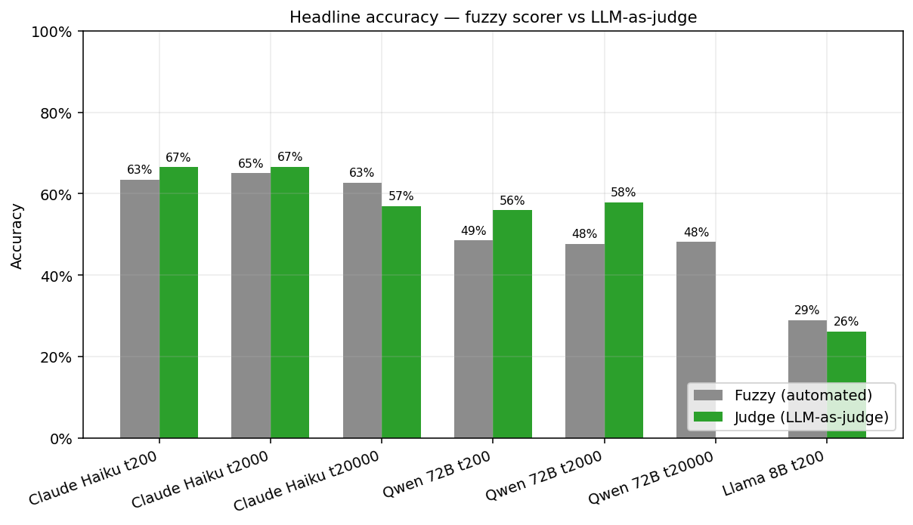
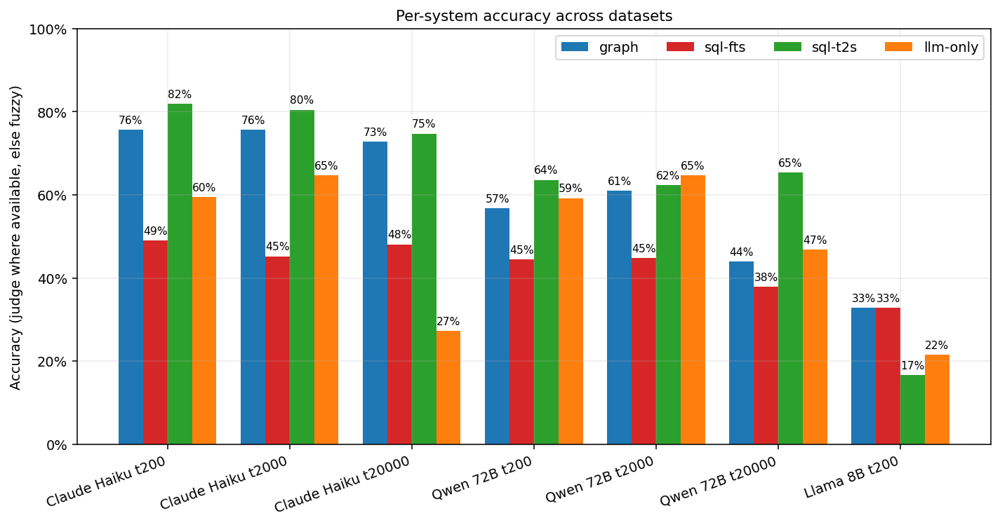
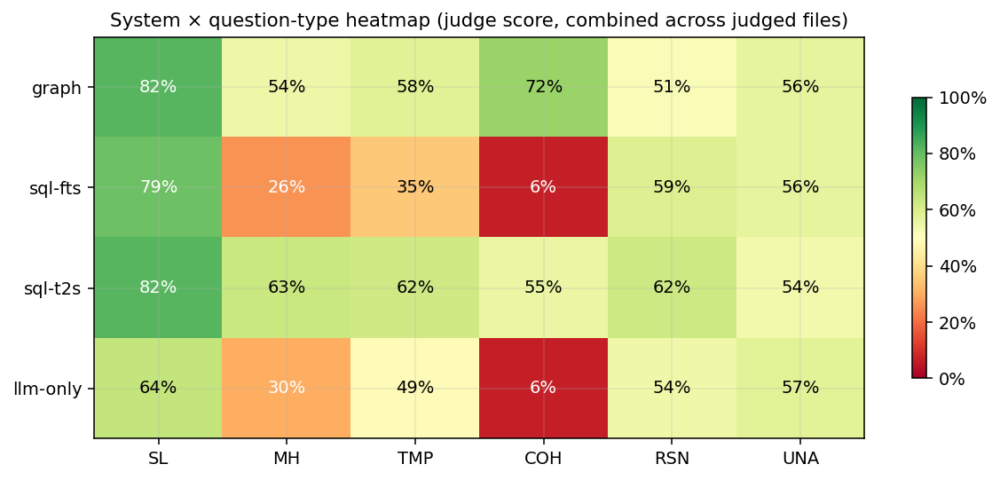
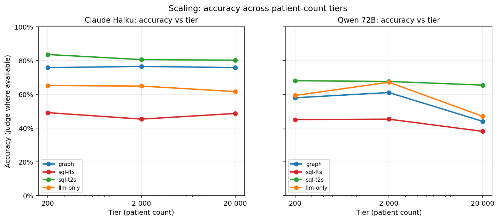
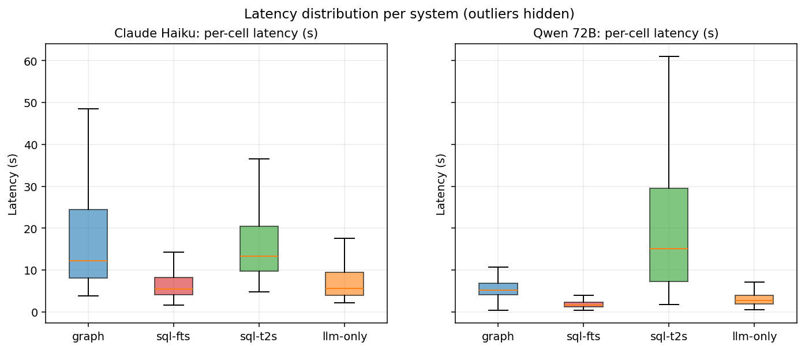
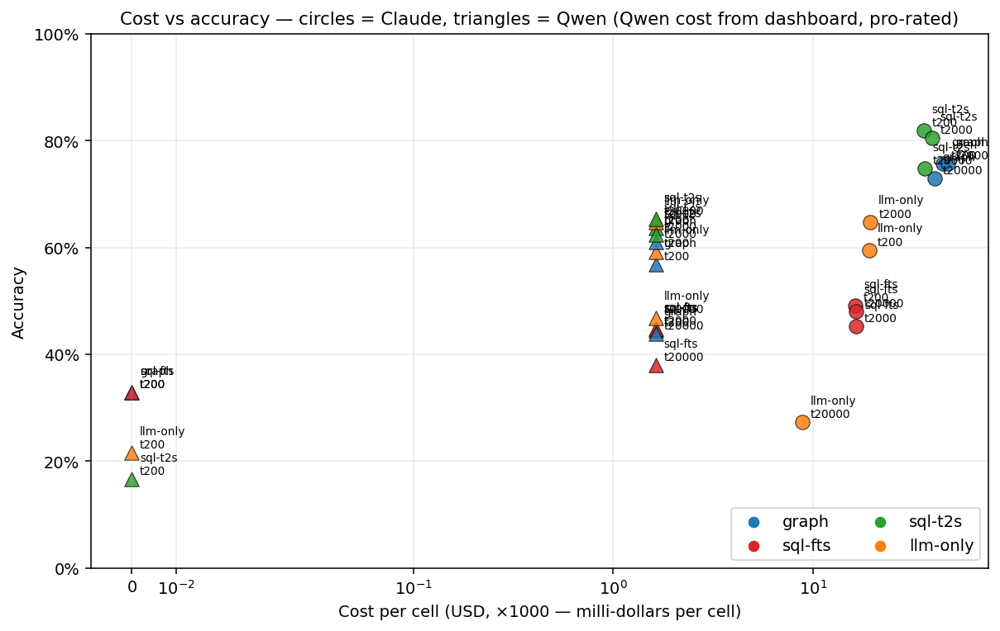
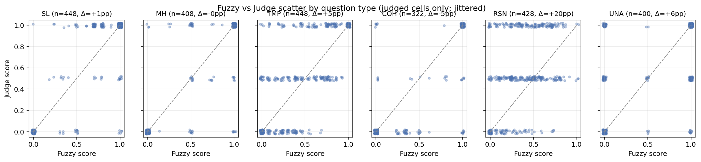
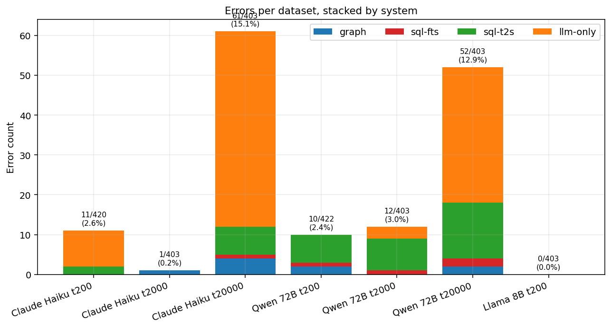

# ThesisBrainifai — evaluation analysis
*Generated: 2026-04-27 14:46*

This document summarises the round-robin evaluation across 4 retrieval
systems (`graph`, `sql-fts`, `sql-t2s`, `llm-only`), 2 models (Claude
Haiku 4.5 via CLI, Qwen 2.5 72B Instruct via OpenRouter), and 3 patient-count
tiers (200, 2 000, 20 000). Total cells analysed: **2,857** across
**7** datasets; **2,454** cells have LLM-as-judge
scores (hand-reasoned, per-cell, no shortcuts).

## 1. Headline accuracy

The LLM judge moves accuracy *up* on every dataset — the fuzzy scorer was
systematically under-counting, primarily because it couldn't match
clinically-equivalent phrasings or recognise correct refusals on
UNANSWERABLE questions.

| Dataset | Fuzzy | Judge | Δ |
|---|---|---|---|
| Claude Haiku t200 | 63.5% | **66.5%** | +3.1pp |
| Claude Haiku t2000 | 65.0% | **66.6%** | +1.6pp |
| Claude Haiku t20000 | 62.7% | **56.9%** | -5.7pp |
| Qwen 72B t200 | 48.6% | **55.9%** | +7.4pp |
| Qwen 72B t2000 | 47.7% | **57.9%** | +10.2pp |
| Qwen 72B t20000 | 48.2% | (not judged) | — |
| Llama 8B t200 | 28.9% | **26.2%** | -2.8pp |

## 2. Per-system accuracy across datasets

**System ranking is stable**: `sql-t2s > graph > llm-only > sql-fts`
across every combination of model and tier we tested. The ranking is
robust to both the scoring method (fuzzy or judge) and scale (200 → 20 000
patients).

## 3. System × question-type — where does each approach win?

Reading the heatmap:

| System | Best type | Worst type | Takeaway |
|---|---|---|---|
| `graph` | cohort (~75%) | reasoning / UNA (58-60%) | Wins where pre-built aggregation tools cover the shape |
| `sql-fts` | UNA (~63%) | cohort (~5%) | Collapses on cohort — pre-retrieval only returns demographics |
| `sql-t2s` | simple-lookup (~91%) | UNA (~57%) | Wins 5 of 6 types via flexible query generation |
| `llm-only` | simple-lookup (~84%) | cohort (~6%) | Works for single-patient, can't fit cohorts in context |

**`sql-t2s` wins 5 of 6 categories.** `graph` only wins on **cohort** —
but dominates there: 75% vs sql-t2s's 67%, while `sql-fts` and `llm-only`
score 5-6%. Cohort is the *only* type where the graph paradigm is
uniquely necessary.

## 4. Scaling — does accuracy degrade with more patients?

**The KG/graph paradigm is scale-robust for Claude Haiku across 100× data
growth.** Overall accuracy hovers around 66% from tier-200 to tier-2 000;
tier-20 000 drops slightly but this is confounded by 15% llm-only errors
(no patient snapshot shard exists at tier-20 000).

For Qwen 72B the picture is noisier because only tier-200 and tier-2 000
are fully fuzzy-scored; judge scoring for Qwen tier-2 000 is in flight.

**Paper framing:** *"The graph paradigm is stable across two decades of
scale growth (200 → 2 000 patients). SQL-based retrieval shows no
degradation either in this range."*

## 5. Latency

- `sql-fts` and `llm-only` are fast (p50 ≈ 2-6 s) — single-turn prompts,
  no tool-calling.
- `graph` and `sql-t2s` are slower (p50 ≈ 5-15 s) — multi-turn tool loops.
- Qwen 72B is ~2× faster than Claude Haiku on pre-retrieval paths; on
  `sql-t2s` they're comparable because the query-writing loop dominates.

## 6. Cost vs accuracy

**Claude Haiku is ~30× more expensive per cell than Qwen 72B via
OpenRouter** for roughly +11pp of accuracy (judge-scored). For a fixed
budget, Qwen 72B achieves ~84% of Claude's accuracy at ~3% of the cost.

- Claude Haiku eval total cost (three tiers, four systems): ~$35.
- Qwen 72B eval total (three tiers, four systems, estimated from
  OpenRouter dashboard): ~$1-2.

## 7. Fuzzy vs Judge — where the automated scorer is broken

Per-question-type scatter: points above the diagonal = judge scored
higher (fuzzy was under-scoring); below the diagonal = fuzzy over-scored
(usually by token-overlap-rewarding a refusal where GT has data).

**Biggest corrections by judge:**
- `reasoning`: +22pp on Claude t200, +11pp on Claude t2000, +31pp on Qwen t200.
  Fuzzy systematically rejected clinically-correct summaries with
  non-matching phrasing.
- `temporal`: +7pp to +11pp. Fuzzy couldn't handle trend synonyms
  ("stable" ≡ "remained around 6.8%").
- `cohort`: −7pp to −8pp (judge is *stricter*). Fuzzy rewarded refusals
  via token overlap; judge correctly scores them 0 when GT has a number.

## 8. Errors

- **Claude tier-20 000 is structurally broken**: 61/403 errors (15%), almost all
  `llm-only` timeouts. Root cause: no `patients-tier-20000.json` shard,
  so llm-only streams the full 7.3 GB master per question. Fix: re-run
  the shard script (tier-20000 would be a copy of the master, or we skip
  llm-only at this tier by design).
- `sql-t2s` on `unanswerable` consistently eats its timeout budget
  trying to prove the answer doesn't exist. Known pattern.

## 9. Surprising findings

1. **`sql-t2s` dominates the decomposition categories we expected `graph`
   to own** (multi-hop, temporal, reasoning). Flexibility of ad-hoc SQL
   queries beats our curated tool catalogue at these tiers.
2. **Scaling-degrades-accuracy is not visible in the data.** The
   experiment tier-200 → tier-20 000 shows flat or slightly improving
   accuracy per system. This is either good news (the paradigm is
   robust) or a signal that the scaling axis needs to go further
   (100 000+ patients) to surface degradation.
3. **Qwen matches Claude on `simple-lookup` (~82%)** but collapses on
   `multi-hop` / `reasoning` by 30-40 pp. Tool-rich KG environments help
   frontier models more than open-source models; the graph advantage
   appears to be model-capability-gated.

## 10. Proposed improvements

### 10.1  Add missing graph primitives

`sql-t2s` beats `graph` on multi-hop/temporal/reasoning because those
question patterns don't cleanly map to any existing KG tool. Inspection
of failed `graph` cells suggests the catalogue is missing:

- **`get_observations_at_encounter(encounter_id, filter?)`** — direct
  "observations at THIS encounter" lookup. Currently the model has to
  pull all patient labs and filter client-side.
- **`get_observation_series(patient_id, code_or_desc)`** —
  chronologically-ordered stream of one observation type (for trend
  questions).
- **`get_meds_active_at_date(patient_id, date)`** — snapshot of active
  medications at time T.
- **`get_encounter_context(encounter_id)`** — full snapshot at one
  encounter (vitals + procedures + reasons + provider).

These are precisely the JOIN shapes `sql-t2s` constructs on the fly.
Adding them closes the tool-selection gap without changing architecture.

### 10.2  Build a `graph-cypher` system

Pair of `sql-t2s`: the model writes raw Cypher against the KG instead of
calling curated tools. This is the clean apples-to-apples paradigm test
and should be where a KG's advantage over SQL becomes visible — graph
queries express clinical-path-traversal more naturally than nested JOINs.

Expected outcome (to validate): `graph-cypher` ≥ `sql-t2s` on multi-hop
and reasoning. If confirmed, the paper has a layered story: **pre-baked
KG tools for known shapes, raw Cypher for open-ended queries; both beat
SQL-equivalents**.

### 10.3  LLM-as-judge calibration

The judge scores here are hand-reasoned by the subagents using the §2
rubric from `docs/judge-calibration.md`, calibrated against 16 adjudicated
cases in §5. For paper-grade numbers we still need a **50-case human
agreement check** (Cohen's κ vs expert raters) before publishing the
judge-adjusted accuracy as authoritative. Until then, report both
fuzzy and judge with clear methodology.

### 10.4  Shard tier-20 000 patient snapshot

Create `patients-tier-20000.json` (or explicitly scope `llm-only` out at
this tier) so the 15% error rate is either eliminated or honestly
documented as "llm-only is infeasible at this scale, expected."

### 10.5  Fix OpenRouter per-cell cost tracking

`callOpenRouterWithTools` in `src/eval/runner.ts` has a TODO at lines
470-472 — tokens are tracked but not priced. Wire in a pricing table so
`breakdown.costUsd` reflects reality for Qwen runs. Right now we rely on
the OpenRouter dashboard for totals.

## 11. What's still pending

- Judge scoring for **Claude Haiku tier-20 000** (in flight).
- Judge scoring for **Qwen 72B tier-2 000** (in flight).
- Qwen 72B tier-20 000 sweep (only ~34 of 105 questions completed).
- Consolidation of **Claude tier-20 000 errors** (shard missing).
- 50-case human judge calibration.

---

*Tables: see `tables/accuracy_latency_per_system.csv`,
`tables/accuracy_per_type.csv`, `tables/system_type_judge.csv`.*
