# Paradigm Comparison for Clinical EHR Question-Answering

## §1. Setup & methodology

Five retrieval paradigms answered each of 334 questions across three models (Claude Haiku 4.5, Qwen 2.5 72B, Llama 3.1 8B) and three patient-cohort tiers (200, 2 000, 20 000). Each (question, model, tier, system) cell received a 3-level score (0, 0.5, 1) from a hand-reasoned LLM-as-judge applying the rubric in `docs/judge-calibration.md` (17 adjudicated calibration cases). Final dataset: **13,640 judged cells**.

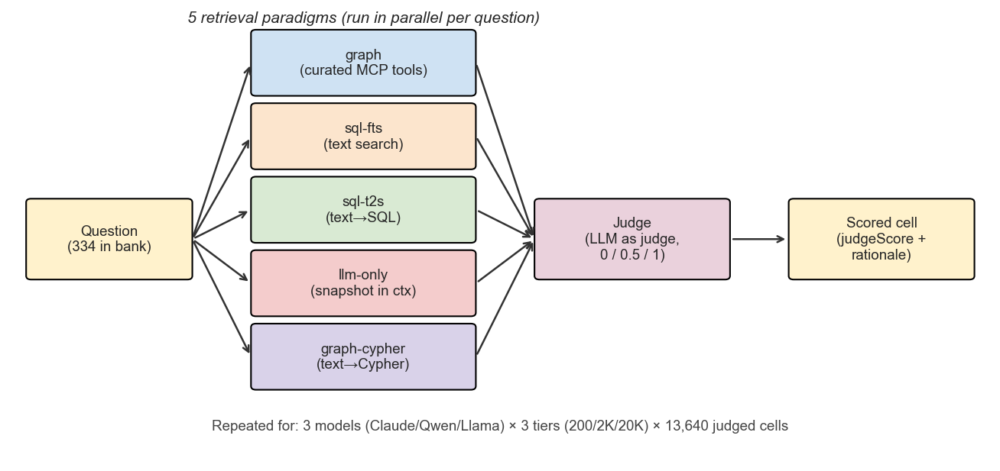

**Cells per (model × tier):**

| Model | tier-200 | tier-2K | tier-20K |
|---|---:|---:|---:|
| claude-haiku-4-5 | 1,479 | 1,599 | 1,470 |
| llama-3.1-8b | 1,600 | 1,585 | 1,416 |
| qwen-2.5-72b | 1,530 | 1,542 | 1,419 |

## §2. Top-line accuracy

Pooled judge-mean across all 5 systems and all 6 question types, per (model × tier):

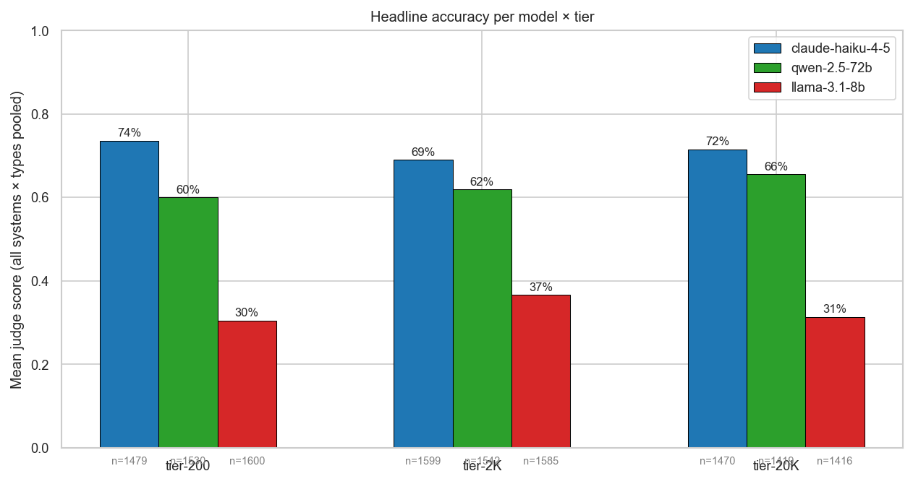

| Model | Tier | n | Judge mean | % full | % partial | % wrong |
|---|---|---:|---:|---:|---:|---:|
| claude-haiku-4-5 | 200 | 1,479 | 0.736 | 65.7% | 15.8% | 18.5% |
| claude-haiku-4-5 | 2000 | 1,599 | 0.690 | 60.2% | 17.7% | 22.1% |
| claude-haiku-4-5 | 20000 | 1,470 | 0.715 | 63.8% | 15.4% | 20.7% |
| llama-3.1-8b | 200 | 1,600 | 0.304 | 23.9% | 13.0% | 63.1% |
| llama-3.1-8b | 2000 | 1,585 | 0.366 | 28.1% | 17.1% | 54.8% |
| llama-3.1-8b | 20000 | 1,416 | 0.314 | 23.4% | 15.8% | 60.7% |
| qwen-2.5-72b | 200 | 1,530 | 0.600 | 51.0% | 18.1% | 30.9% |
| qwen-2.5-72b | 2000 | 1,542 | 0.619 | 53.2% | 17.4% | 29.4% |
| qwen-2.5-72b | 20000 | 1,419 | 0.655 | 56.9% | 17.1% | 25.9% |

*Interpretation:* Claude leads at every tier; Qwen ranks second; Llama trails by a wide margin under the pooled view because tool-using systems contribute many zeros for that model.

**Best paradigm per (model × tier)** — the practical view if you deploy only the strongest system for each model:

| Model | Tier | Best system | Best judge mean | Pooled mean (all 5 systems) |
|---|---|---|---:|---:|
| claude-haiku-4-5 | 200 | sql-t2s | 0.885 | 0.736 |
| claude-haiku-4-5 | 2000 | sql-t2s | 0.806 | 0.690 |
| claude-haiku-4-5 | 20000 | graph-cypher | 0.837 | 0.715 |
| llama-3.1-8b | 200 | sql-fts | 0.676 | 0.304 |
| llama-3.1-8b | 2000 | sql-fts | 0.646 | 0.366 |
| llama-3.1-8b | 20000 | sql-fts | 0.592 | 0.314 |
| qwen-2.5-72b | 200 | sql-t2s | 0.736 | 0.600 |
| qwen-2.5-72b | 2000 | sql-t2s | 0.730 | 0.619 |
| qwen-2.5-72b | 20000 | sql-t2s | 0.766 | 0.655 |

*Interpretation:* once each model picks its best paradigm, the headline gap narrows but remains large: Claude ≈ 0.85, Qwen ≈ 0.75, Llama ≈ 0.55–0.62 (sql-fts wins for Llama because of its tool-calling failure mode).

## §3. Metric validity: fuzzy vs hand-judge

The original automated metric is a fuzzy token-overlap score against the ground-truth string. The LLM judge applies a hand-reasoned clinical rubric. The judge is the metric used everywhere else in this report; this section documents agreement between the two.

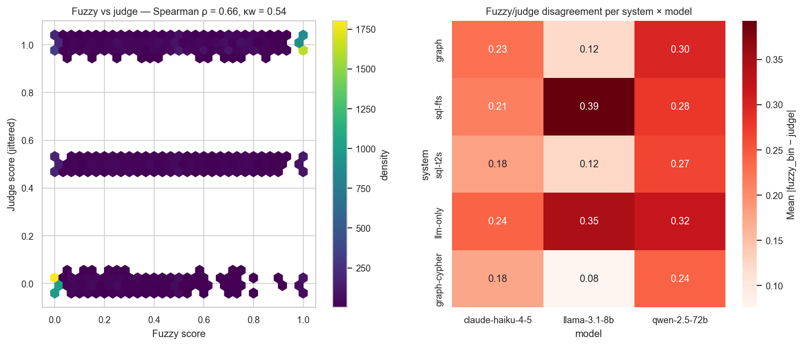

Overall: Spearman ρ = **0.66**, weighted κ (3-level) = **0.54**.

| Model | n | Spearman ρ | Weighted κ |
|---|---:|---:|---:|
| claude-haiku-4-5 | 4,548 | 0.60 | 0.52 |
| qwen-2.5-72b | 4,491 | 0.57 | 0.44 |
| llama-3.1-8b | 4,601 | 0.58 | 0.47 |

*Interpretation:* moderate agreement only (κ ≈ 0.44–0.52). The fuzzy scorer systematically penalises long-form clinical answers and fails to recognise correct UNANSWERABLE refusals, so we use the judge throughout this report.

## §4. Paradigm ranking per (model × tier)

System means with 95% bootstrap CIs:

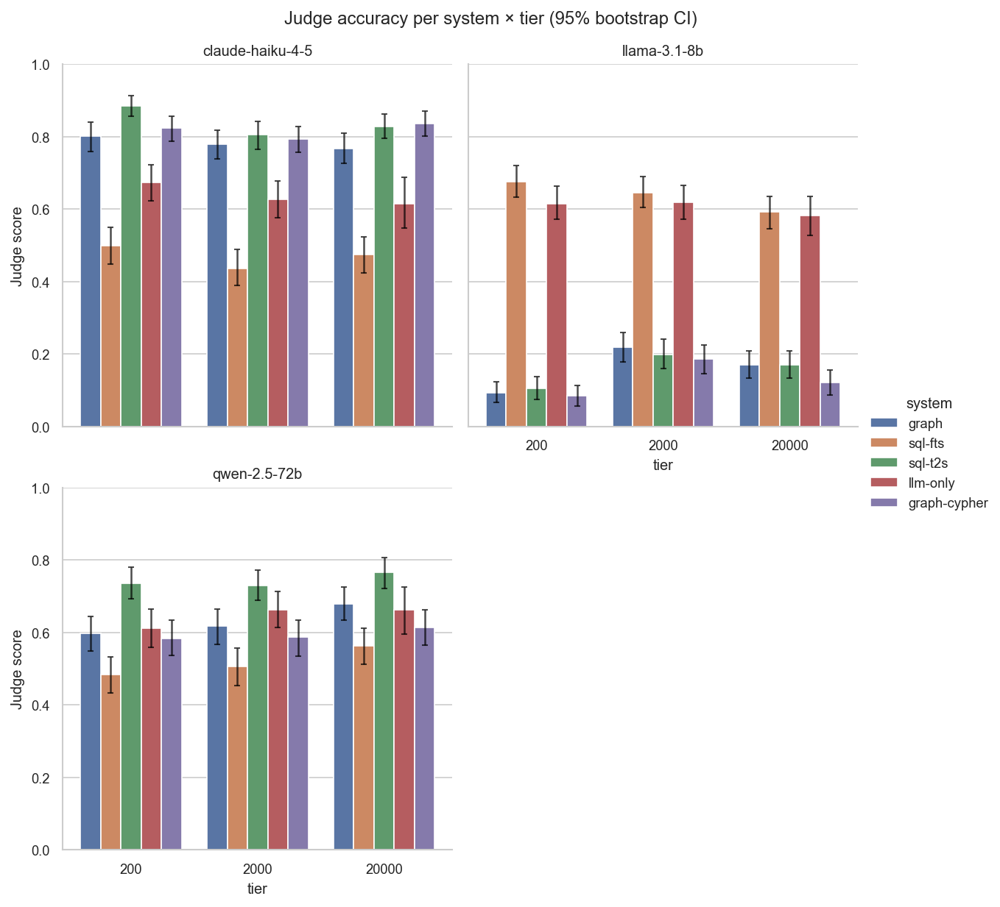

Failure-mode breakdown — fraction of cells scoring 1.0, 0.5, and 0:

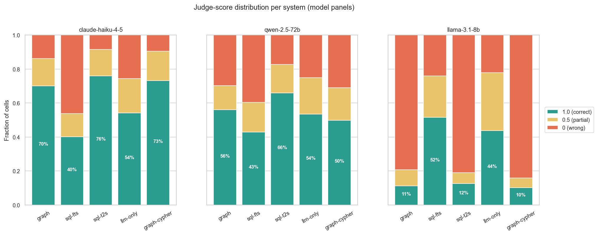

| Model | Tier | System | n | Mean | 95% CI |
|---|---|---|---:|---:|---|
| claude-haiku-4-5 | 200 | graph | 281 | 0.801 | [0.760, 0.840] |
| claude-haiku-4-5 | 200 | graph-cypher | 330 | 0.824 | [0.788, 0.856] |
| claude-haiku-4-5 | 200 | llm-only | 262 | 0.674 | [0.622, 0.721] |
| claude-haiku-4-5 | 200 | sql-fts | 315 | 0.500 | [0.448, 0.551] |
| claude-haiku-4-5 | 200 | sql-t2s | 291 | 0.885 | [0.856, 0.912] |
| claude-haiku-4-5 | 2000 | graph | 326 | 0.779 | [0.739, 0.817] |
| claude-haiku-4-5 | 2000 | graph-cypher | 332 | 0.794 | [0.757, 0.828] |
| claude-haiku-4-5 | 2000 | llm-only | 274 | 0.628 | [0.577, 0.677] |
| claude-haiku-4-5 | 2000 | sql-fts | 334 | 0.436 | [0.389, 0.488] |
| claude-haiku-4-5 | 2000 | sql-t2s | 333 | 0.806 | [0.766, 0.842] |
| claude-haiku-4-5 | 20000 | graph | 327 | 0.768 | [0.726, 0.809] |
| claude-haiku-4-5 | 20000 | graph-cypher | 331 | 0.837 | [0.802, 0.870] |
| claude-haiku-4-5 | 20000 | llm-only | 147 | 0.616 | [0.548, 0.687] |
| claude-haiku-4-5 | 20000 | sql-fts | 333 | 0.474 | [0.423, 0.523] |
| claude-haiku-4-5 | 20000 | sql-t2s | 332 | 0.828 | [0.795, 0.861] |
| llama-3.1-8b | 200 | graph | 329 | 0.093 | [0.067, 0.123] |
| llama-3.1-8b | 200 | graph-cypher | 331 | 0.085 | [0.057, 0.113] |
| llama-3.1-8b | 200 | llm-only | 274 | 0.615 | [0.571, 0.664] |
| llama-3.1-8b | 200 | sql-fts | 333 | 0.676 | [0.632, 0.721] |
| llama-3.1-8b | 200 | sql-t2s | 333 | 0.105 | [0.075, 0.138] |
| llama-3.1-8b | 2000 | graph | 325 | 0.218 | [0.178, 0.260] |
| llama-3.1-8b | 2000 | graph-cypher | 323 | 0.186 | [0.146, 0.226] |
| llama-3.1-8b | 2000 | llm-only | 272 | 0.619 | [0.572, 0.665] |
| llama-3.1-8b | 2000 | sql-fts | 333 | 0.646 | [0.604, 0.689] |
| llama-3.1-8b | 2000 | sql-t2s | 332 | 0.199 | [0.160, 0.241] |
| llama-3.1-8b | 20000 | graph | 306 | 0.170 | [0.134, 0.209] |
| llama-3.1-8b | 20000 | graph-cypher | 288 | 0.122 | [0.087, 0.156] |
| llama-3.1-8b | 20000 | llm-only | 188 | 0.582 | [0.527, 0.636] |
| llama-3.1-8b | 20000 | sql-fts | 331 | 0.592 | [0.545, 0.636] |
| llama-3.1-8b | 20000 | sql-t2s | 303 | 0.170 | [0.134, 0.210] |
| qwen-2.5-72b | 200 | graph | 328 | 0.598 | [0.549, 0.645] |
| qwen-2.5-72b | 200 | graph-cypher | 293 | 0.584 | [0.536, 0.633] |
| qwen-2.5-72b | 200 | llm-only | 271 | 0.611 | [0.559, 0.664] |
| qwen-2.5-72b | 200 | sql-fts | 331 | 0.483 | [0.432, 0.532] |
| qwen-2.5-72b | 200 | sql-t2s | 307 | 0.736 | [0.692, 0.780] |
| qwen-2.5-72b | 2000 | graph | 333 | 0.617 | [0.566, 0.665] |
| qwen-2.5-72b | 2000 | graph-cypher | 310 | 0.587 | [0.535, 0.634] |
| qwen-2.5-72b | 2000 | llm-only | 261 | 0.663 | [0.613, 0.713] |
| qwen-2.5-72b | 2000 | sql-fts | 321 | 0.506 | [0.453, 0.556] |
| qwen-2.5-72b | 2000 | sql-t2s | 317 | 0.730 | [0.689, 0.771] |
| qwen-2.5-72b | 20000 | graph | 327 | 0.679 | [0.635, 0.725] |
| qwen-2.5-72b | 20000 | graph-cypher | 297 | 0.613 | [0.564, 0.663] |
| qwen-2.5-72b | 20000 | llm-only | 167 | 0.662 | [0.596, 0.725] |
| qwen-2.5-72b | 20000 | sql-fts | 323 | 0.562 | [0.512, 0.611] |
| qwen-2.5-72b | 20000 | sql-t2s | 305 | 0.766 | [0.721, 0.807] |

*Interpretation:* for Claude and Qwen, sql-t2s consistently ranks first and sql-fts last; graph and graph-cypher are statistically indistinguishable from each other. For Llama, the ordering flips entirely: sql-fts and llm-only are best, the three tool-using systems collapse to 10–20%.

## §5. Statistical confirmation of the ranking

Four tests, sequenced omnibus → pairwise, with each available in both ordinal and binary form.

### §5.1 Friedman (ordinal omnibus)

H₀: all five systems have the same distribution of judge scores on the same questions.

| Model | Tier | n questions | χ² | p |
|---|---|---:|---:|---:|
| claude-haiku-4-5 | 200 | 226 | 104.8 | 9.22e-22 |
| claude-haiku-4-5 | 2000 | 267 | 162.6 | 4.02e-34 |
| claude-haiku-4-5 | 20000 | 143 | 86.7 | 6.60e-18 |
| llama-3.1-8b | 200 | 266 | 589.1 | 3.59e-126 |
| llama-3.1-8b | 2000 | 255 | 363.7 | 1.89e-77 |
| llama-3.1-8b | 20000 | 160 | 266.6 | 1.72e-56 |
| qwen-2.5-72b | 200 | 214 | 35.1 | 4.42e-07 |
| qwen-2.5-72b | 2000 | 227 | 25.6 | 3.76e-05 |
| qwen-2.5-72b | 20000 | 145 | 19.1 | 7.66e-04 |

*Interpretation:* every combination rejects H₀ at p ≪ 0.001 — at least one system differs.

### §5.2 Cochran's Q (binary omnibus)

Same hypothesis as Friedman but with the judge score binarised. Strict cutoff = `judge == 1.0`; lenient cutoff = `judge ≥ 0.5`.

| Cutoff | Model | Tier | n | k | Q | p |
|---|---|---|---:|---:|---:|---:|
| strict | claude-haiku-4-5 | 200 | 226 | 5 | 82.2 | 6.06e-17 |
| strict | claude-haiku-4-5 | 2000 | 267 | 5 | 137.2 | 1.14e-28 |
| strict | claude-haiku-4-5 | 20000 | 143 | 5 | 74.5 | 2.57e-15 |
| strict | llama-3.1-8b | 200 | 266 | 5 | 388.8 | 7.48e-83 |
| strict | llama-3.1-8b | 2000 | 255 | 5 | 198.7 | 7.31e-42 |
| strict | llama-3.1-8b | 20000 | 160 | 5 | 134.1 | 5.24e-28 |
| strict | qwen-2.5-72b | 200 | 214 | 5 | 31.7 | 2.25e-06 |
| strict | qwen-2.5-72b | 2000 | 227 | 5 | 16.6 | 2.32e-03 |
| strict | qwen-2.5-72b | 20000 | 145 | 5 | 23.9 | 8.51e-05 |
| lenient | claude-haiku-4-5 | 200 | 226 | 5 | 137.0 | 1.23e-28 |
| lenient | claude-haiku-4-5 | 2000 | 267 | 5 | 150.0 | 2.07e-31 |
| lenient | claude-haiku-4-5 | 20000 | 143 | 5 | 102.4 | 3.01e-21 |
| lenient | llama-3.1-8b | 200 | 266 | 5 | 583.6 | 5.62e-125 |
| lenient | llama-3.1-8b | 2000 | 255 | 5 | 366.3 | 5.18e-78 |
| lenient | llama-3.1-8b | 20000 | 160 | 5 | 287.4 | 5.55e-61 |
| lenient | qwen-2.5-72b | 200 | 214 | 5 | 26.7 | 2.23e-05 |
| lenient | qwen-2.5-72b | 2000 | 227 | 5 | 37.3 | 1.56e-07 |
| lenient | qwen-2.5-72b | 20000 | 145 | 5 | 15.7 | 3.41e-03 |

*Interpretation:* Cochran's Q rejects H₀ at p ≪ 0.001 in all 18 combinations (9 × 2 cutoffs) — the binary framing confirms the ordinal one.

### §5.3 Pairwise Wilcoxon signed-rank (ordinal, Bonferroni-corrected)

Each cell shows mean(row) − mean(col). Stars: `*p<.05, **p<.01, ***p<.001`.

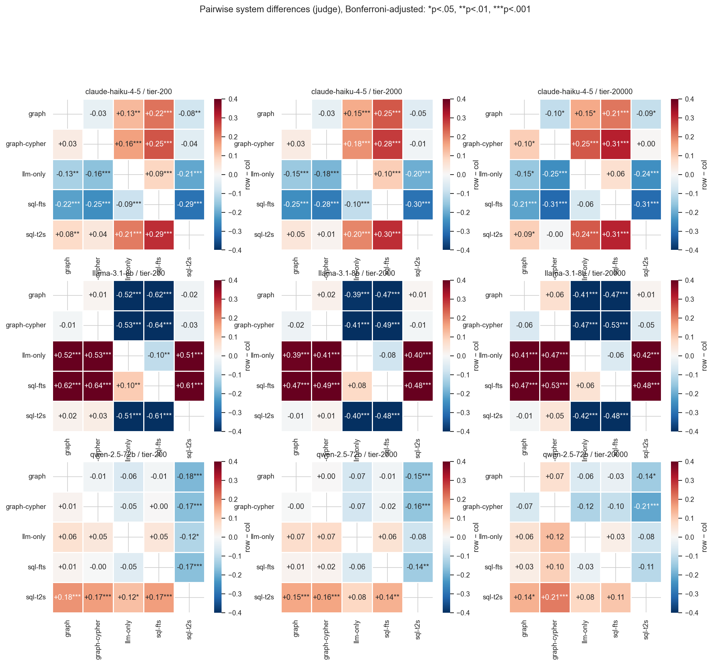

Full table with Cliff's δ effect sizes: `tables/3_pairwise_wilcoxon.csv`.

*Interpretation:* for Claude and Qwen, sql-t2s significantly beats every other system in nearly every (tier) combination. For Llama, sql-fts and llm-only significantly beat the three tool-using systems by 30–55 percentage points.

### §5.4 Pairwise McNemar (binary, Bonferroni-corrected)

Strict cutoff:

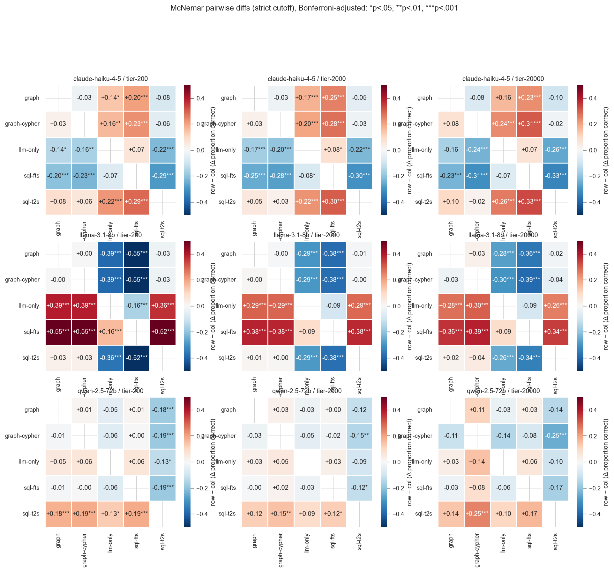

Lenient cutoff:

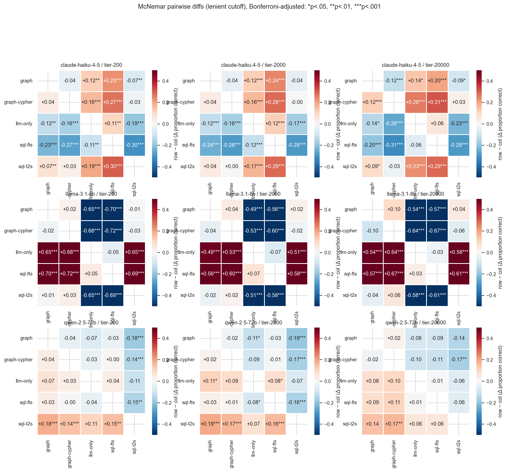

Full McNemar table with discordant-pair counts (b/c): `tables/3c_mcnemar_pairs.csv`.

*Interpretation:* McNemar agrees with Wilcoxon — the same pairs are significant under both cutoffs, with effect sizes 5–55 percentage points.

## §6. Where each paradigm wins (question type × system)

Mean judge score per (model × type × system), pooled across tiers:

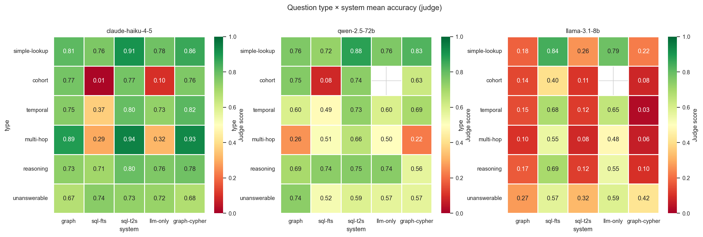

**Best paradigm per (model × question type)** — derived from the heatmap:

| Type | Claude best (score) | Qwen best (score) | Llama best (score) |
|---|---|---|---|
| simple-lookup | sql-t2s (0.91) | sql-t2s (0.88) | sql-fts (0.84) |
| cohort | sql-t2s (0.77) | graph (0.75) | sql-fts (0.40) |
| temporal | graph-cypher (0.82) | sql-t2s (0.73) | sql-fts (0.68) |
| multi-hop | sql-t2s (0.94) | sql-t2s (0.66) | sql-fts (0.55) |
| reasoning | sql-t2s (0.80) | sql-t2s (0.75) | sql-fts (0.69) |
| unanswerable | sql-fts (0.74) | graph (0.74) | llm-only (0.59) |

*Interpretation:* sql-t2s wins the most type slots for capable models; graph wins specifically on cohort. For Llama every type's winner is sql-fts or llm-only (i.e. the non-tool-using paths).

## §7. Scaling across cohort sizes

Mean judge score per (model × system) across the three patient-cohort tiers:

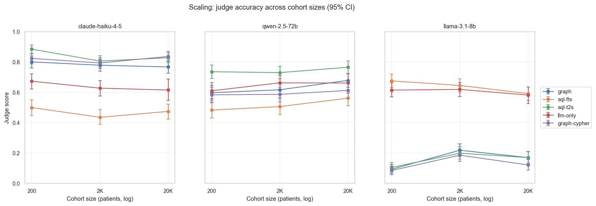

**Linear regression of judge on log₁₀(tier):**

| Model | System | Slope per log₁₀ tier | 95% CI | r | p |
|---|---|---:|---|---:|---:|
| claude-haiku-4-5 | graph | -0.016 | [-0.045, +0.012] | -0.04 | 2.64e-01 |
| claude-haiku-4-5 | graph-cypher | +0.006 | [-0.019, +0.031] | +0.02 | 6.17e-01 |
| claude-haiku-4-5 | llm-only | -0.031 | [-0.073, +0.011] | -0.06 | 1.48e-01 |
| claude-haiku-4-5 | sql-fts | -0.012 | [-0.048, +0.024] | -0.02 | 5.01e-01 |
| claude-haiku-4-5 | sql-t2s | -0.027 | [-0.052, -0.003] | -0.07 | 2.96e-02 |
| llama-3.1-8b | graph | +0.040 | [+0.014, +0.066] | +0.10 | 2.63e-03 |
| llama-3.1-8b | graph-cypher | +0.020 | [-0.004, +0.045] | +0.05 | 1.07e-01 |
| llama-3.1-8b | llm-only | -0.015 | [-0.051, +0.021] | -0.03 | 4.22e-01 |
| llama-3.1-8b | sql-fts | -0.042 | [-0.073, -0.010] | -0.08 | 9.00e-03 |
| llama-3.1-8b | sql-t2s | +0.033 | [+0.007, +0.060] | +0.08 | 1.36e-02 |
| qwen-2.5-72b | graph | +0.041 | [+0.007, +0.075] | +0.07 | 1.91e-02 |
| qwen-2.5-72b | graph-cypher | +0.015 | [-0.021, +0.050] | +0.03 | 4.20e-01 |
| qwen-2.5-72b | llm-only | +0.028 | [-0.012, +0.068] | +0.05 | 1.72e-01 |
| qwen-2.5-72b | sql-fts | +0.039 | [+0.004, +0.074] | +0.07 | 2.72e-02 |
| qwen-2.5-72b | sql-t2s | +0.015 | [-0.016, +0.045] | +0.03 | 3.46e-01 |

*Interpretation:* slopes are small (|slope| < 0.05 in every case); CIs for most slopes cross zero. No paradigm shows pronounced accuracy degradation from 200 to 20 000 patients.

## §8. Cross-model comparison on shared questions

**Tool-using mean − llm-only mean**, per (model × tier):

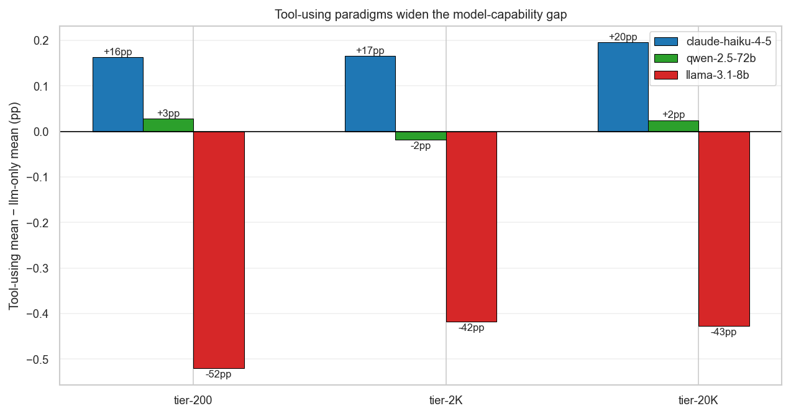

**Win rate** — fraction of questions where each system is best-or-tied:

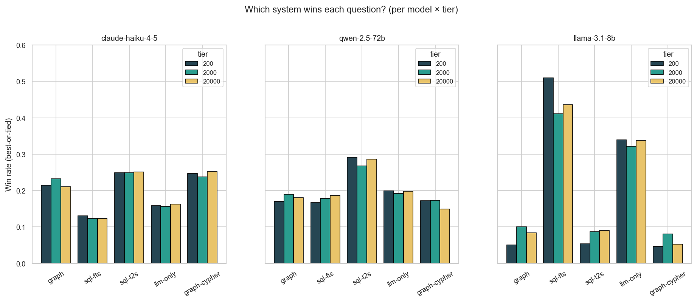

**Friedman test on shared questions** (Claude vs Qwen vs Llama, paired per question):

| System | Tier | n | Claude | Qwen | Llama | χ² | p |
|---|---|---:|---:|---:|---:|---:|---:|
| graph | 200 | 271 | 0.80 | 0.61 | 0.10 | 305.2 | 5.22e-67 |
| graph | 2000 | 316 | 0.78 | 0.61 | 0.22 | 214.5 | 2.61e-47 |
| graph | 20000 | 295 | 0.76 | 0.69 | 0.17 | 269.1 | 3.65e-59 |
| graph-cypher | 200 | 288 | 0.82 | 0.59 | 0.09 | 315.9 | 2.52e-69 |
| graph-cypher | 2000 | 297 | 0.79 | 0.59 | 0.19 | 243.0 | 1.68e-53 |
| graph-cypher | 20000 | 260 | 0.82 | 0.63 | 0.12 | 276.0 | 1.18e-60 |
| llm-only | 200 | 249 | 0.69 | 0.61 | 0.61 | 12.5 | 1.96e-03 |
| llm-only | 2000 | 259 | 0.62 | 0.66 | 0.63 | 2.2 | 3.26e-01 |
| llm-only | 20000 | 129 | 0.62 | 0.70 | 0.56 | 12.9 | 1.58e-03 |
| sql-fts | 200 | 311 | 0.50 | 0.48 | 0.67 | 43.1 | 4.39e-10 |
| sql-fts | 2000 | 320 | 0.43 | 0.50 | 0.64 | 67.3 | 2.39e-15 |
| sql-fts | 20000 | 319 | 0.47 | 0.56 | 0.59 | 21.6 | 2.06e-05 |
| sql-t2s | 200 | 265 | 0.89 | 0.74 | 0.11 | 351.3 | 5.19e-77 |
| sql-t2s | 2000 | 315 | 0.81 | 0.73 | 0.20 | 305.8 | 3.88e-67 |
| sql-t2s | 20000 | 276 | 0.83 | 0.77 | 0.17 | 289.5 | 1.36e-63 |

*Interpretation:* tool-using paradigms give Claude +16 to +20pp over llm-only, give Qwen approximately zero net change, and cost Llama −42 to −52pp. The model-capability gap on the same questions is far larger for tool-using paradigms than for llm-only.

## §9. Operational tradeoffs: latency and tool-loop length

Per-question latency in seconds (boxplots, outliers hidden):

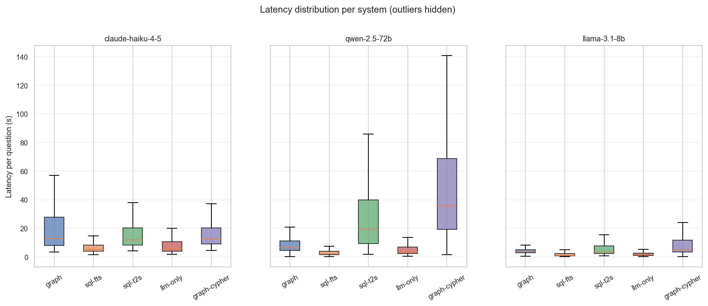

Tool-loop length (number of LLM↔tool turns; only tool-using systems):

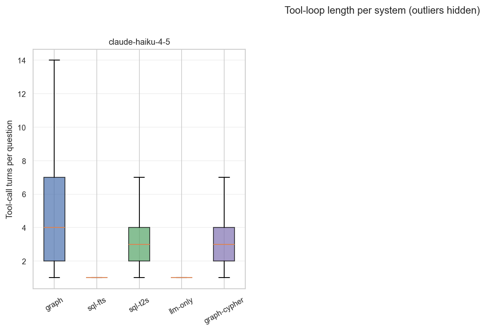

**Median latency per (model × system):**

| Model | System | n | Median (s) | Mean (s) |
|---|---|---:|---:|---:|
| claude-haiku-4-5 | graph | 934 | 12.8 | 20.4 |
| claude-haiku-4-5 | graph-cypher | 993 | 12.7 | 18.7 |
| claude-haiku-4-5 | llm-only | 683 | 6.0 | 8.1 |
| claude-haiku-4-5 | sql-fts | 982 | 5.4 | 6.9 |
| claude-haiku-4-5 | sql-t2s | 956 | 12.2 | 17.5 |
| llama-3.1-8b | graph | 960 | 3.7 | 5.7 |
| llama-3.1-8b | graph-cypher | 942 | 5.0 | 11.3 |
| llama-3.1-8b | llm-only | 734 | 1.7 | 3.3 |
| llama-3.1-8b | sql-fts | 997 | 1.2 | 3.1 |
| llama-3.1-8b | sql-t2s | 968 | 3.5 | 7.9 |
| qwen-2.5-72b | graph | 988 | 6.6 | 9.9 |
| qwen-2.5-72b | graph-cypher | 900 | 35.9 | 53.8 |
| qwen-2.5-72b | llm-only | 699 | 3.9 | 5.6 |
| qwen-2.5-72b | sql-fts | 975 | 2.1 | 3.6 |
| qwen-2.5-72b | sql-t2s | 929 | 19.2 | 30.8 |

*Interpretation:* sql-fts and llm-only are single-turn and fastest (~2–6 s median). Tool-using systems take several LLM↔tool turns; Qwen graph-cypher runs longest (~36 s median) because of repeated query-fix loops.

## §10. Error patterns and threats to validity

Two flags emitted alongside the judge score: `gt_suspect` (judge believes the ground truth is wrong) and `over_answered` (correct facts present but buried in extras).

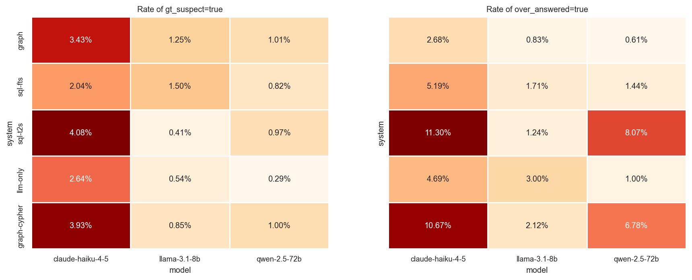

**Recurring GT issues flagged across multiple cells** (top 15 by flag count):

| QID | Type | Times flagged |
|---|---|---:|
| UNA-108 | unanswerable | 15 |
| RSN-76 | reasoning | 14 |
| COH-24 | cohort | 13 |
| RSN-56 | reasoning | 12 |
| COH-29 | cohort | 11 |
| RSN-54 | reasoning | 10 |
| SL-14 | simple-lookup | 9 |
| COH-31 | cohort | 9 |
| TMP-12 | temporal | 8 |
| COH-40 | cohort | 7 |
| SL-160 | simple-lookup | 6 |
| MH-53 | multi-hop | 6 |
| COH-4 | cohort | 6 |
| COH-37 | cohort | 4 |
| SL-BRIDGE-4 | simple-lookup | 4 |

*Interpretation:* the most-flagged questions cluster in cohort (COH-23/24/26/27/28/29 — numeric mismatches), unanswerable (UNA-108 — income IS in Synthea), and reasoning (RSN-54/56/76 — over-narrow guideline GTs). These are dataset issues, not system failures.

## §11. Files manifest

| File | Description |
|---|---|
| `tables/long_format.csv` | Every judged cell — the master file for re-analysis |
| `tables/1_descriptive_means.csv` | System means + 95% bootstrap CIs |
| `tables/2_friedman.csv` | Friedman omnibus test per (model, tier) |
| `tables/3_pairwise_wilcoxon.csv` | Pairwise Wilcoxon + Cliff's δ + Bonferroni p |
| `tables/3b_cochran_q.csv` | Cochran's Q omnibus (strict + lenient cutoffs) |
| `tables/3c_mcnemar_pairs.csv` | Pairwise McNemar with b/c counts |
| `tables/4_scaling_regression.csv` | log-tier regression slopes |
| `tables/5_type_system_means.csv` | Mean judge per (model, type, system) |
| `tables/6_fuzzy_judge_agreement.csv` | Spearman + weighted κ per model |
| `tables/8_flag_rates.csv` | gt_suspect + over_answered rates |
| `tables/12_latency.csv` | Median + mean latency per (model, system) |
| `tables/9_cross_model_friedman.csv` | Friedman across models per (system, tier) |
| `tables/10_top_summary.csv` | Top-line summary used in §2 |
| `tables/15_best_paradigm_per_model.csv` | Best system per (model, tier) for §2 |
| `tables/16_best_system_per_type.csv` | Best system per (model, type) for §6 |
| `tables/17_gt_flagged_questions.csv` | GT-suspect counts per question |

### Schema of `long_format.csv`

| Column | Type | Description |
|---|---|---|
| `model` | str | claude-haiku-4-5 / qwen-2.5-72b / llama-3.1-8b |
| `tier` | int | 200 / 2000 / 20000 patient-cohort size |
| `system` | str | graph / sql-fts / sql-t2s / llm-only / graph-cypher |
| `qid` | str | Question identifier (e.g. SL-19, COH-14) |
| `type` | str | simple-lookup / cohort / temporal / multi-hop / reasoning / unanswerable |
| `judge` | float | 0.0, 0.5, or 1.0 — primary outcome |
| `fuzzy` | float | Original token-overlap score; secondary outcome |
| `latency_ms` | float | End-to-end latency for the system's answer |
| `cost_usd` | float | API cost (Claude only; OpenRouter omits) |
| `turns` | int | Number of LLM↔tool turns (tool-using systems only) |
| `gt_suspect` | bool | Judge flagged the ground-truth as suspect |
| `over_answered` | bool | Judge flagged answer as containing correct facts amid significant unrelated content |